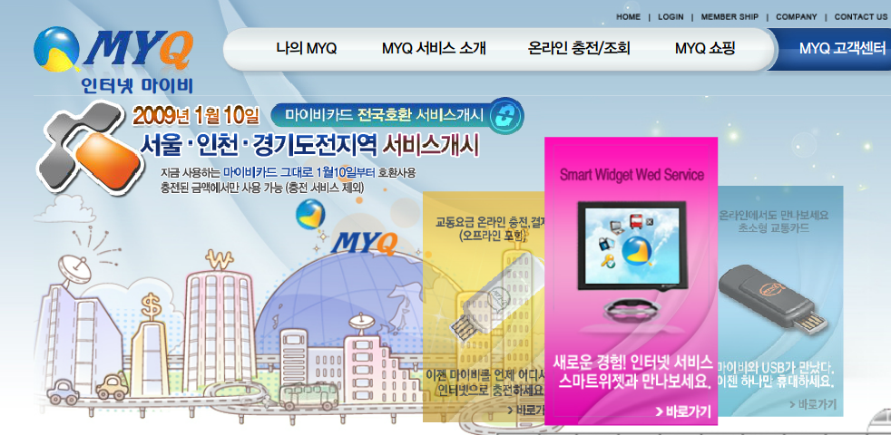
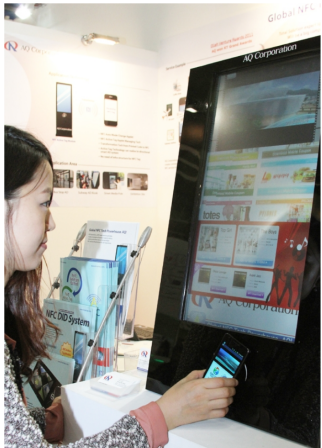
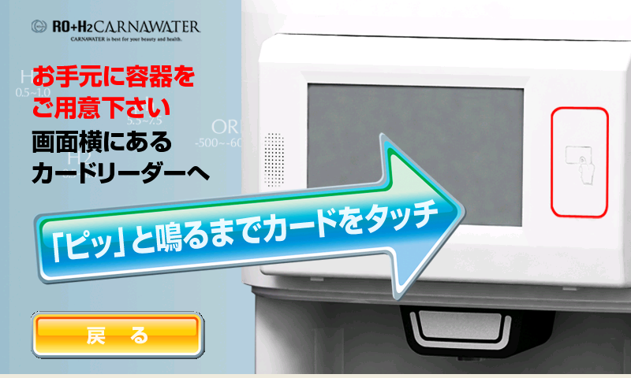
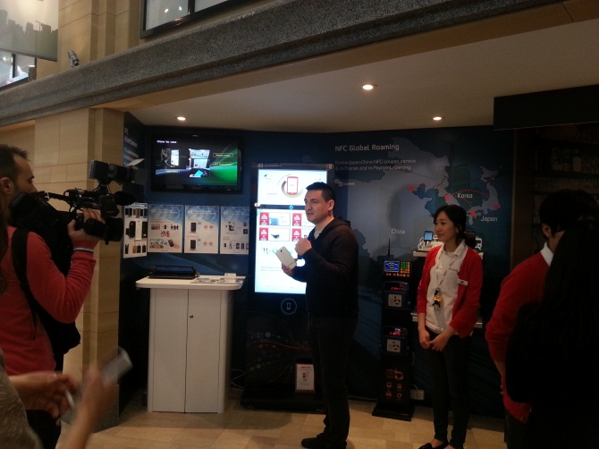
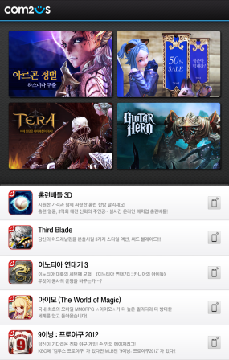
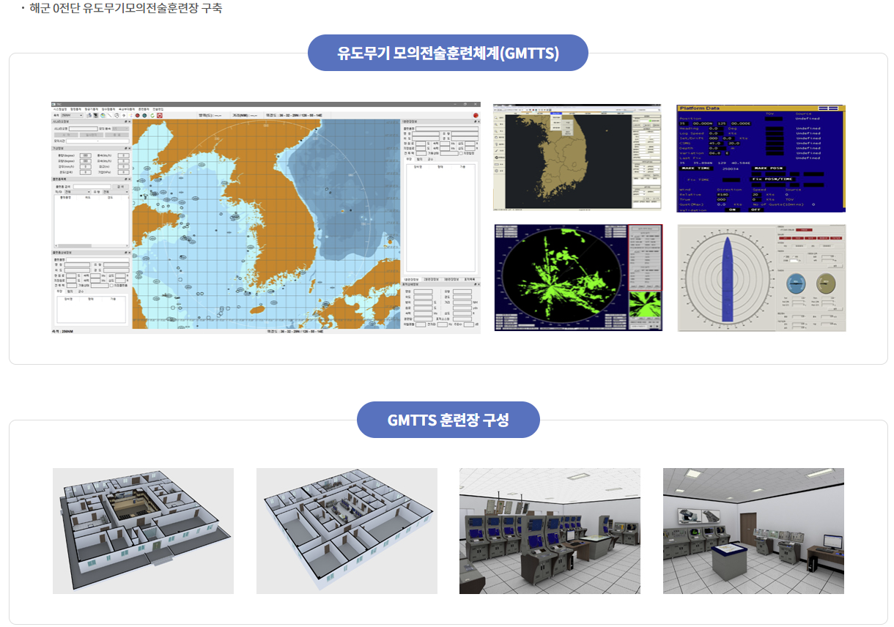
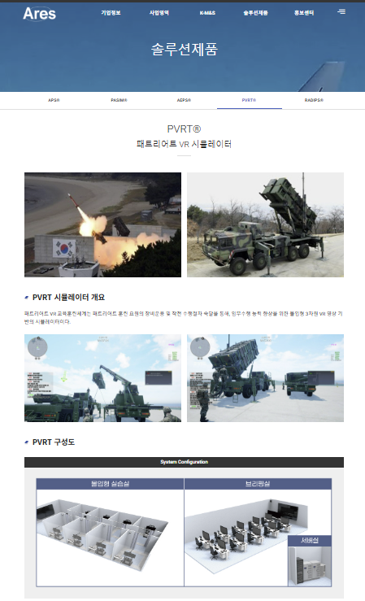
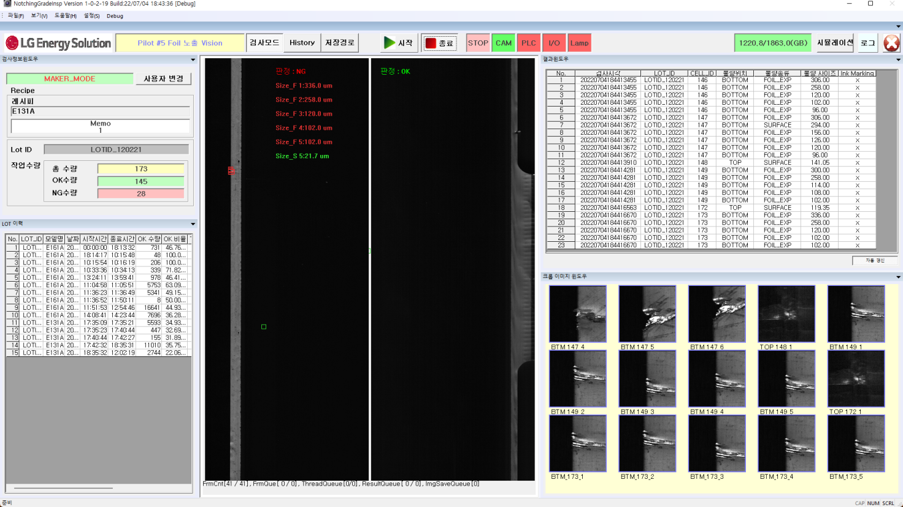
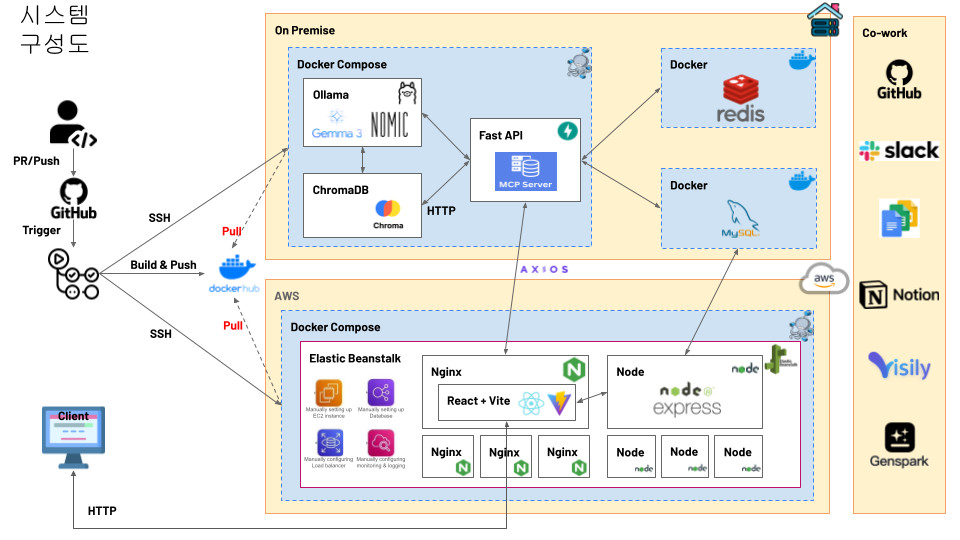
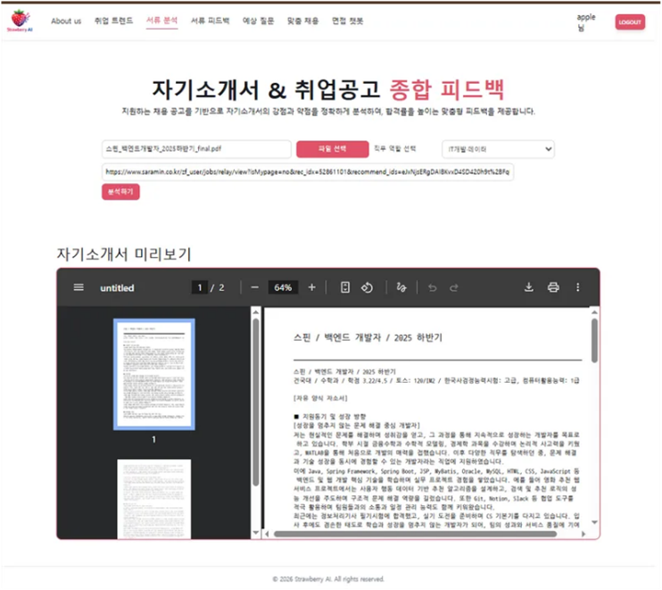

# 이력서

<table>
<tr>
<td width="220" valign="top">

</td>
<td valign="top">

| 항목             | 내용                                                                      |
| ---------------- | ------------------------------------------------------------------------- |
| **성 명**        | 이 현 무                                                                  |
| **성 별**        | 남자                                                                      |
| **주민등록번호** | 700220-1X                                                                 |
| **생년월일**     | 1970년 2월 20일                                                           |
| **주소**         | 경기도 남양주시 진관로22번안길12(다산동)                                  |
| **연락처**       | 전화: 031-556-1458 휴대폰: 010-3888-5763 이메일: vawing21@naver.com |

</td>
</tr>
</table>

---

## 📘 학력

| 기간                      | 학교                             |
| ------------------------- | -------------------------------- |
| 1985년 03월 ~ 1988년 02월 | 동화 고등학교 졸업               |
| 2010년 03월 ~ 2014년 02월 | 한국방송통신대 컴퓨터과학과 졸업 |

---

## 🙋‍♂️ 자기소개

저는 **C++ 기반 시스템 개발을 출발점으로**,  
군 시뮬레이션·VR 교육훈련, 산업용 비전 검사, 배터리 검사 시스템까지  
**실제 장비·공정·데이터가 연결되는 소프트웨어**를 개발해 온 엔지니어입니다.

초기에는 **MMORPG 클라이언트·서버 개발**을 통해  
수학 기반 로직 설계, 엔진 구조 이해, 네트워크 시스템의 기초를 다졌으며,  
이후 **국방·방산 분야**에서 실제 무기체계와 동일한 운용 절차를  
소프트웨어로 구현하는 훈련 시스템을 다수 개발했습니다.

SM-2, RAM, 패트리어트, 대함 레이더, 음탐 보조 장비 등  
실장비를 직접 분석하여 발사·운용·정비 UI와  
**네트워크 기반 협업 훈련 체계**로 구현한 경험은  
단순 시뮬레이션을 넘어 **현장성과 신뢰성이 요구되는 시스템 개발 역량**을  
쌓는 계기가 되었습니다.

이후 **산업 자동화 분야**에서는  
2차전지 전극부 **Notching 공정 비전 검사 시스템** 개발을 담당하며  
라인 카메라 기반 표면 결함 검출, PLC 연동, Trigger/Encoder 동기화,  
공정 단위 검사 결과를 셀 위치와 연계하여  
최종 검사까지 이어지는 시스템의 일부를 개발했습니다.

또한 **10년 이상 운용된 일본산 Film 검사 장비**를  
VS2008 기반 레거시 환경에서 **Windows 10 호환 환경으로 개선·납품**하며  
현장 안정성과 유지보수 관점의 문제 해결 능력도 강화했습니다.

최근에는 기존 시스템 개발 경험을 **웹·AI·클라우드 영역으로 확장**하고자  
다음 기술들을 실무 수준으로 학습·활용하고 있습니다.

- **풀스택**: React, Node.js, JavaScript, Vite, Webpack
- **AI / Python**: 머신러닝·딥러닝, Jupyter, Colab, Uvicorn
- **환경**: WSL, Ubuntu, AWS, Docker, Ollama
- **DB**: MySQL, Redis
- **형상관리**: Git, GitHub

특히 **Docker 기반 개발·운영 환경 구축과 아키텍처 설계**를 강점으로 하여,  
로컬–WSL–Linux–AWS 환경을 동일한 컨테이너 구조로 구성하고  
DB ERD 설계부터 백엔드 API, 프론트엔드 빌드,  
GitHub Actions 기반 자동 빌드·배포 파이프라인까지  
직접 구성한 경험을 보유하고 있습니다.

저는 새로운 기술을 단순히 배우는 데서 그치지 않고,  
기존의 **대규모 시스템 개발·하드웨어 연동·현장 경험과 결합해  
실제로 동작하는 구조로 구현하는 개발자**입니다.

앞으로도 실무에서 검증된 시스템 개발 역량을 기반으로  
AI·클라우드·자동화 기술을 접목한  
**신뢰성 높은 소프트웨어 아키텍처를 설계·구현하는 엔지니어**로  
지속 성장해 나가고자 합니다.

### Git

<table>
  <thead>
    <tr>
      <th>프로젝트명</th>
      <th>Git URL</th>
    </tr>
  </thead>
  <tbody>
    <tr>
      <td>배터리 검사/진단 장비 SW</td>
      <td>
        <a href="https://github.com/lhmpaiPublic/PTCProject.git">
          https://github.com/lhmpaiPublic/PTCProject.git
        </a>
      </td>
    </tr>
    <tr>
      <td>군 훈련체계(데이터 해상도 변환)</td>
      <td>
        <a href="https://github.com/lhmpaiPublic/MRMProject.git">
          https://github.com/lhmpaiPublic/MRMProject.git
        </a>
      </td>
    </tr>
    <tr>
      <td>AI McpServer 이슈</td>
      <td>
        <a href="https://github.com/codelabStrawberry/McpServer/issues">
          https://github.com/codelabStrawberry/McpServer/issues
        </a>
      </td>
    </tr>
    <tr>
      <td>AI ReactNodeServer 이슈</td>
      <td>
        <a href="https://github.com/codelabStrawberry/ReactNodeServer/issues">
          https://github.com/codelabStrawberry/ReactNodeServer/issues
        </a>
      </td>
    </tr>
    <tr>
      <td>AI React FastAPI Server 이슈</td>
      <td>
        <a href="https://github.com/codelabstartup/StartupServer/issues">
          https://github.com/codelabstartup/StartupServer/issues
        </a>
      </td>
    </tr>
  </tbody>
</table>

## 🛠 경력 및 자격

---

### ▪ 자격 · 교육

| 기간              | 기관                 | 내용                                           |
| ----------------- | -------------------- | ---------------------------------------------- |
| 1988/09           | 서울지방경찰청       | 1종 보통, 대형, 렉커, 트레일러                 |
| 2012/08           | 한국산업인력관리공단 | 정보처리기능사                                 |
| 2005/01 ~ 2005/08 | KH정보교육원         | VC 네트워크 프로그래밍 과정                    |
| 2025/05 ~ 2025/01 | 코드랩 아카데미학원  | AI 인공지능 웹서비스 풀스택 개발자(AICC딥러닝) |

---

### ▪ 경력 사항

#### 🏭 프로텍코퍼레이션㈜ · 연구개발부 부장

**산업용 비전·검사 시스템 개발 (2023 ~ 2025)**

- 2차전지 전극부 Notching 공정 대상 **라인카메라 기반 비전 검사 프로그램 개발**
- 호일 절연부 가공 공정 **절연부 이상·이물질 검출 알고리즘 구현**
- 가공 단위별 검사 결과를 **PLC 기반 셀 위치 연동 → 최종 검사까지 연결**
- **Trigger 보드·Encoder 연동** 검사 타이밍·위치 동기화 처리
- PLC 통신, DIO 신호 처리, **소켓 통신 기반 조명(Light) 컨트롤 연동**
- 검사 위치 ID 부여, 데이터 전송, **SPC+ 연동 및 JSON 결과 파일 생성**
- 검사 운영 시스템(UI 포함) 개발 및 **현장 적용 안정화**

**LG에너지솔루션 배터리 셀 가공·검사 시스템**

- 시스템 안정화 및 성능 개선
- 초당 약 30셀 검사 환경에서 발생한 **시스템 다운·위치 불일치 버그 분석·수정**
- 중국·인도네시아·미국 등 글로벌 생산라인 환경 차이에 따른 **위치 버스 오류 개선**
- LG 요구사항 기반 **검사 정보 수집 JSON 데이터 구조 재설계·구현**
- 일본산 Film 검사 시스템 **Win7/VS2008 → Win10 호환 환경 개선·납품**
- Film 검사 종류 **10종 → 20종 확장**, Recipe·검출 로직 업그레이드
- 다수 고객사(KOLON, SKIE, 효성) **유지보수 수행**
- 배터리 충·방전(BMS/ESS) **Tester·시뮬레이션 기반 검사 프로그램 개발 및 IO 카드 연동**

---

#### 🎮 ㈜유토비즈 · 개발부 차장

**군 VR·CBT 교육훈련 시스템 개발 (2022)**

- VR 기반 군 장비 운용·정비 교육체계 개발
- 대함레이더, 헬기 이착함 유도·전력공급, 음탐보조장비 시뮬레이션
- 실제 장비 운용 절차 분석 기반 **시나리오형 VR 훈련 및 협업 엔진 구현**
- 다수 교육생 **VR 협업 네트워크 및 훈련 통제 시스템 개발**
- PLC 연동 모의장비 제어 소프트웨어 개발
- 시리얼 통신 기반 LED 램프·모터 등 **실제 장비 신호 제어**
- Qt/C++ 기반 VR·CBT 훈련 소프트웨어 개발, **DB 연동 및 DES 암호화 처리**

---

#### 🛰 아레스㈜ · S/W개발부 부장

**군 시뮬레이션·무기체계·훈련 시스템 개발 (2014 ~ 2022)**

- 해군 분석모델 간 네트워크 연동 및 데이터 추출 시스템 유지보수
- 다수 분석모델 간 훈련 데이터 통합·동기화 기능 개선
- Linux 기반 **합동정보모의 시뮬레이션 엔진 개발 참여**
- 한국군 사이버 훈련 체계 연동 대규모 작전 시뮬레이션 네트워크 구축
- 육·해·공 훈련 데이터 **DB 수집·관리 통합 처리 체계 구현**
- DB 기반 훈련 시나리오 관리 및 실시간 데이터 다운로드 기능 개발
- 엔진·상황도·DB 간 **실시간 네트워크 연동 구조 설계·구현**

**무기체계·VR 훈련**

- 항공무장 효과분석 모델 비행·무장 시뮬레이션 검증
- 유도무기 모의전술훈련장 체계 개발 (SM-2, RAM)
- 발사 절차·운용 흐름 분석 기반 UI 및 발사 기능 구현
- 발사·비행·요격 전 과정 시뮬레이션 구현
- CBT 기반 전술 훈련 모델 적용
- Qt 기반 무기체계 운용 UI·훈련 시스템 개발
- 다중 해상도 모델 통합 및 변환 알고리즘 개발
- 패트리어트 VR 교육훈련체계 구축
- 군 실장비·DB·네트워크·VR 통합 훈련 시뮬레이션 경험

---

#### 🖥 모노시스㈜ · 기술개발부

**군 사이버·시뮬레이션 시스템 개발 (2014)**

- 군 사이버 훈련 시스템 유지보수 및 실시간 데이터 처리 개선
- 대규모 훈련 체계 간 네트워크 데이터 연계·동기화 구조 개선
- 육군 C4I 연동 **LVC(실기동·가상·모의) 통합 시스템 개발**
- DDS 기반 통신 미들웨어 아키텍처 설계 및 Adapter 개발
- Live 체계 실시간 데이터 교환 요구사항 분석·설계 문서화

---

#### 📡 에이큐㈜ · 솔루션개발실

**NFC · Windows · WinCE 임베디드 시스템 개발 (2010 ~ 2013)**

- NFC 표준 기반 Windows NFC SDK·모듈 설계·개발
- Mybi USB 교통카드 온라인 충전 시스템 개발·운영
- Windows/Android NFC Application 및 Driver 개발
- WinCE 기반 NFC/RFID 결제 임베디드 시스템 구현
- Windows–모바일 NFC 양방향 통신 프로토콜 설계
- KT 버스쉘터·다음 디지털뷰 NFC 광고·쿠폰 서비스 개발
- Windows / WinCE / Android / Linux **크로스 플랫폼 개발 경험**

---

#### 🎮 키프엔터테인먼트 · 소프트웨어팀

**C++ / Direct3D 기반 MMORPG 게임 프로그래머 (2006.06 ~ 2007.11)**

- Windows MMORPG 클라이언트·서버 핵심 시스템 설계·구현
- Direct3D 엔진 커스터마이징 및 3D 수학 연산 모듈 개발
- 아이템·스킬 서버 로직 및 확률 기반 게임 알고리즘 설계
- 3D 충돌 판정, 이펙트 시스템 개발 및 성능 최적화
- 대규모 레거시 C++ 프로젝트 개발·유지보수 경험
  |

---

## 📂 프로젝트 경력사항

<table border="1" cellspacing="0" cellpadding="5">
  <thead>
    <tr>
      <th>순서</th>
      <th>프로젝트명</th>
    </tr>
  </thead>
  <tbody>
    <tr>
      <td>1</td>
      <td>스마트카드 Plug&Play 윈도우 위젯 개발</td>
    </tr>
    <tr>
      <td>2</td>
      <td>Windows용 NFC 솔루션 개발</td>
    </tr>
    <tr>
      <td>3</td>
      <td>수소수 정수기 Water 판매 및 결제 시스템 개발</td>
    </tr>
    <tr>
      <td>4</td>
      <td>Windows용 NFC 단말기 HW 인터페이스 모듈 개발</td>
    </tr>
    <tr>
      <td>5</td>
      <td>Daum Digital View·KT Bus Shelter NFC 솔루션 개발</td>
    </tr>
    <tr>
      <td>6</td>
      <td>유도무기 모의 전술훈련장 체계 개발</td>
    </tr>
    <tr>
      <td>7</td>
      <td>패트리어트 미사일 VR 시뮬레이션 훈련체계 개발</td>
    </tr>
    <tr>
      <td>8</td>
      <td>Foil 노출 검사 소프트웨어 개발</td>
    </tr>
    <tr>
      <td>9</td>
      <td>sLLM과 RAG을 활용한 취업 준비를 위한 AI 에이전트 개발</td>
    </tr>
  </tbody>
</table>

---

## 🔧 사용 가능 기술

<table border="1" cellspacing="0" cellpadding="5">
  <thead>
    <tr>
      <th>구분</th>
      <th>내용</th>
    </tr>
  </thead>
  <tbody>
    <tr>
      <td><strong>언어</strong></td>
      <td>VisualC++, Delphi7, Java(안드로이드), gcc(리눅스), ATL/COM, WTL, GDB 디버깅, Qt(C++), React, Node.js, Python</td>
    </tr>
    <tr>
      <td><strong>Database</strong></td>
      <td>MSSQL, ORACLE, MySQL, MariaDB, SQLite</td>
    </tr>
    <tr>
      <td><strong>스펙 지식</strong></td>
      <td>NFC 표준, Mifare Card, A-Type Card, Windows PCSC, 군 무기체계, 군 훈련체계, 배터리 셀 검사</td>
    </tr>
    <tr>
      <td><strong>기타</strong></td>
      <td>PLC 연동 시스템 개발, 엔코더 연동 시스템, 기타 HW 연동 시스템 개발</td>
    </tr>
  </tbody>
</table>

---

**위의 내용은 사실과 다름없음을 확인합니다.**  
**작성자 : 이현무 (인)**

## 1. 프로젝트 경력사항

=================================================================

#### 1. 기 관 : 애니쿼터스

<table border="1" cellspacing="0" cellpadding="6" style="border-collapse:collapse; width:100%;">
  <tr>
    <th style="width:180px;">프로젝트명</th>
    <td>스마트카드 Plug & Play 윈도우용 위젯 개발</td>
  </tr>
  <tr>
    <th>개발 환경</th>
    <td>Windows XP (데스크탑)</td>
  </tr>
  <tr>
    <th>언어 / Tools</th>
    <td>Visual C++ 6.0 (MFC), Visual C++ 2003 (Win32 API, MFC)</td>
  </tr>
  <tr>
    <th>사용 기술</th>
    <td>
      Socket, Image Skin, Window Region, DES 암호화, 
      PCSC (Personal Computer Smart Card) 통신, 
      Windows 드라이버 및 레지스트리 설정
    </td>
  </tr>
  <tr>
    <th>프로젝트 내용</th>
    <td>
      스마트카드 Plug & Play 위젯은 스마트카드 기능을 사용자 PC 환경에서
      손쉽게 사용할 수 있도록 제공하는 Windows 기반 애플리케이션입니다.  
      교통카드 조회, 공인인증서 플러그인 연동, 스마트카드 드라이버 자동 설치,
      PC 보안 기능, 제휴사 사이트 연결 기능을 제공하였습니다.  
      
    </td>
  </tr>
</table>

#### 2. 기 관 : AQ

<table border="1" cellspacing="0" cellpadding="5">
  <tr>
    <th style="width:150px;">프로젝트명</th>
    <td>윈도우용 NFC 솔루션 개발</td>
  </tr>
  <tr>
    <th>개발 환경</th>
    <td>WindowsXP(데스크탑, WinCE단말기)</td>
  </tr>
  <tr>
    <th>언어/Tools</th>
    <td>Visual C++ 2003 (Win32API, WTL)</td>
  </tr>
  <tr>
    <th>사용 기술</th>
    <td>Image Skin, PCSC(Personal Computer Smart Card) 통신</td>
  </tr>
  <tr>
    <th>프로젝트 내용</th>
    <td>
      NFC 솔루션은 Near Field Communication(근거리 무선통신) 비즈니스 모델 구성을 위한 홍보 Application, NFC 표준 스펙 구현 모듈, NFC 칩 통신 방법 등을 구성하기 위한 시스템입니다. 
      초기 NFC 폰(피처폰)의 기능에 대한 비즈니스 모델 설계와 생소한 NFC에 대한 발전, 진화 방향을 위해서 모듈 구성, 해외 NFC 기능 홍보 App 제작. 
      
    </td>
  </tr>
</table>

#### 3. 기 관 : 일본

<table border="1" cellspacing="0" cellpadding="5">
  <tr>
    <th style="width:180px;">프로젝트명</th>
    <td>수소수 정수기 Water 판매 및 결제 시스템 개발</td>
  </tr>
  <tr>
    <th>개발 환경</th>
    <td>WinXP (WinCE 단말기)</td>
  </tr>
  <tr>
    <th>언어/Tools</th>
    <td>Visual C++ 2003 (Win32API, WTL)</td>
  </tr>
  <tr>
    <th>사용 기술</th>
    <td>
      RS-232, PCSC(Personal Computer Smart Card) 통신, Mifare Card 충전 결제(Read, Write), 
      HTTP 프로토콜 통신(업데이트 파일 다운로드 기능), 정수기 작동 PCB 통신(정수기 컨트롤 프로토콜)
    </td>
  </tr>
  <tr>
    <th>프로젝트 내용</th>
    <td>
      수소수 판매 시스템은 정수기 관리, 수소수 판매, 카드 결제, 카드 충전을 통합적으로 할 수 있는 시스템입니다. 
      실행환경은 WinCE입니다. 
      수소수 정수기에서 신용카드 Tag 후 결제하는 네트워크 시스템을 WinCE 환경에서 개발한 시스템입니다. 
      
    </td>
  </tr>
</table>

#### 4. 기 관 : AQ

<table border="1" cellspacing="0" cellpadding="5">
  <tr>
    <th style="width:180px;">프로젝트명</th>
    <td>윈도우용 NFC 단말기용 솔루션 개발(NFC 하드웨어 인터페이스 모듈 개발)</td>
  </tr>
  <tr>
    <th>개발 환경</th>
    <td>WinXP, Win7</td>
  </tr>
  <tr>
    <th>언어/Tools</th>
    <td>Visual C++ 2008(Win32API, WTL)</td>
  </tr>
  <tr>
    <th>사용 기술</th>
    <td>DLL NFC 컴포넌트 제작</td>
  </tr>
  <tr>
    <th>프로젝트 내용</th>
    <td>
      AQ NFC 솔루션은 Windows 기반에서 동작하는 AQ NFC 하드웨어를 사용하기 위한 시스템입니다. 
      NFC 관련 국내 및 MWC 해외전시회에서 시연하는 장면입니다. 
      
    </td>
  </tr>
</table>

#### 5. 기 관 : Daum, KT

<table border="1" cellspacing="0" cellpadding="5">
  <tr>
    <th style="width:180px;">프로젝트명</th>
    <td>Daum Disital View 및 KT Bus Shelter NFC 솔루션 개발</td>
  </tr>
  <tr>
    <th>개발 환경</th>
    <td>Win7</td>
  </tr>
  <tr>
    <th>언어/Tools</th>
    <td>Visual C++ 2008(Win32API, WTL)</td>
  </tr>
  <tr>
    <th>사용 기술</th>
    <td>DLL 컴포넌트 UI 솔루션 제작하여 제공(Window 추상화 : Window 그래픽)</td>
  </tr>
  <tr>
    <th>프로젝트 내용</th>
    <td>
      본 프로젝트는 AQ NFC 솔루션을 실제 적용하기 AQ Component 시스템입니다. 
      KT, Daum에서 NFC에 대한 지식 없이 사용할 수 있는 구조 구현한 AQ Component를 KT, Daum 개발자가 사용하기 위한 작업입니다. 
      
    </td>
  </tr>
</table>

#### 6. 기 관 : 국방부

<table border="1" cellspacing="0" cellpadding="5">
  <tr>
    <th style="width:180px;">프로젝트명</th>
    <td>유도무기 모의 전술훈련장 체계 개발</td>
  </tr>
  <tr>
    <th>개발 환경</th>
    <td>윈도우10</td>
  </tr>
  <tr>
    <th>언어/Tools</th>
    <td>QT(C++)</td>
  </tr>
  <tr>
    <th>사용 기술</th>
    <td>
      함정에서 유도무기를 발사하여 타겟에 도달하기 위한 알고리즘 개발 
      (실제 장비와 같은 기능을 하는 소프트웨어용 UI 포함) 
      네트워크 연동
    </td>
  </tr>
  <tr>
    <th>프로젝트 내용</th>
    <td>
      본 프로젝트는 함정에 배치된 유도무기 발사에 필요한 훈련을 하기 위하여 개발된 소프트웨어용 군 훈련체계입니다. 
      담당업무: SM2, RAM 미사일에 대한 네트워크 연동, 발사 시뮬레이션 데이터 생성 및 발사 알고리즘 개발. 
      
    </td>
  </tr>
</table>

#### 7. 기 관 : 국방부

<table border="1" cellspacing="0" cellpadding="5">
  <tr>
    <th style="width:180px;">프로젝트명</th>
    <td>패트리어트 미사일 시뮬레이션 VR 훈련체계 개발</td>
  </tr>
  <tr>
    <th>개발 환경</th>
    <td>윈도우11</td>
  </tr>
  <tr>
    <th>언어/Tools</th>
    <td>QT(C++)</td>
  </tr>
  <tr>
    <th>사용 기술</th>
    <td>네트워크연동, DB연동, 교육진행 및 평가 시스템</td>
  </tr>
  <tr>
    <th>프로젝트 내용</th>
    <td>
      본 프로젝트는 패트리어트 미사일 발사 훈련을 VR을 이용하여 교육하기 위해서 개발된 프로그램입니다. 
      담당업무: 훈련을 진행하기 위한 엔진 설계 및 훈련 네트워크연결, DB연동하여 훈련평가 등 VR을 제외한 프로그램 개발. 
      
    </td>
  </tr>
</table>

#### 8. 기 관 : LG엔솔

<table border="1" cellspacing="0" cellpadding="5">
  <tr>
    <th style="width:180px;">프로젝트명</th>
    <td>Foil 노출 검사 소프트웨어 개발</td>
  </tr>
  <tr>
    <th>개발 환경</th>
    <td>윈도우11</td>
  </tr>
  <tr>
    <th>언어/Tools</th>
    <td>Visual C++ 2019(MFC)</td>
  </tr>
  <tr>
    <th>사용 기술</th>
    <td>라인카메라를 활용한 비전검사, PLC, 엔코더, 트리거, 네트워크연동</td>
  </tr>
  <tr>
    <th>프로젝트 내용</th>
    <td>
      본 프로젝트는 밧데리 셀 공정에서 전극부분의 절연이 벗겨지는 부분을 검사하는 프로그램입니다. 
      이미지를 취득하여 비전검사를 진행합니다. 
      담당업무는: 비전검사 알고리즘을 제외한 시스템 개발. 
      
    </td>
  </tr>
</table>

#### 9. 기 관 : 코드랩 아카데미학원

<table border="1" cellspacing="0" cellpadding="5">
  <tr>
    <th style="width:180px;">프로젝트명</th>
    <td>sLLM과 RAG을 활용한 취업 준비를 위한 AI 에이전트 개발</td>
  </tr>
  <tr>
    <th>개발 환경</th>
    <td>윈도우,docker(우분투)</td>
  </tr>
  <tr>
    <th>언어/Tools</th>
    <td>VSCode</td>
  </tr>
  <tr>
    <th>사용 기술</th>
    <td>javascript, react, nginx, node.js, fastapi, ollama, chromadb, mysql, redis, aws(EC2, Beanstalk), github(Actions) </td>
  </tr>
  <tr>
    <th>프로젝트 내용</th>
    <td>
      본 프로젝트는 취업준비생을 위한 종합서비스입니다. 
      취업공고 종합피드백, 면접예상질문제공, AI챗봇면접등 6개의 서비스를 이루어져 있습니다.  
      담당업무는:  
      a. 개발에서 배포까지 전체적인 아키텍쳐 구성 
      b. github를 활용한 CI/CD(자동배포) 구성 
      c. AWS 웹서비스 배포환경 구성 및 배포 
      d. AI 서버를 집(Linux)에 배포환경 구성하여 웹서버와 연결 구성 
      <프로젝트 시스템구성도> 
       
      <프로젝트 UI> 
      
    </td>
  </tr>
</table>
