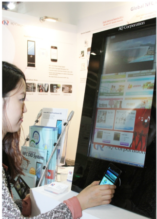
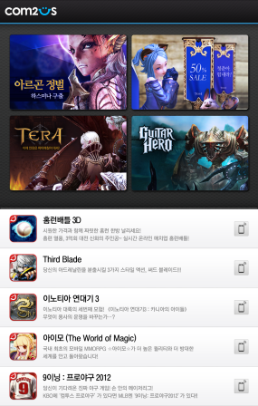
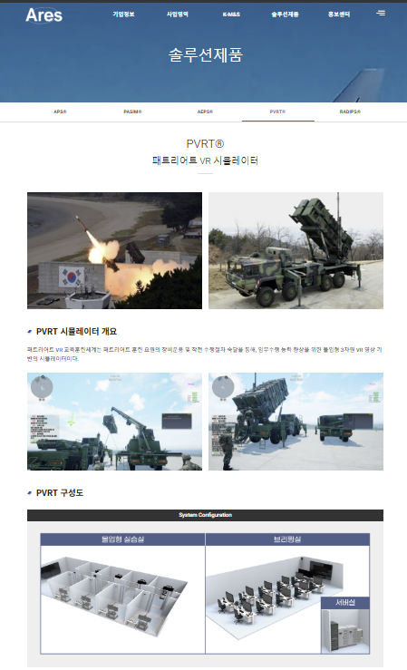

</img>

|                   |                                          |
| ----------------- | ---------------------------------------- |
| 성 명             | 이 현 무                                 |
| 성 별             | 남자                                     |
| 주 민 등 록 번 호 | 700220-1X                                |
| 생 년 월 일       | 1970년 2월 20일                          |
| 주 소             | 경기도 남양주시 진관로22번안길12(다산동) |
| 연 락 처          | 전화 : 031-556-1458                      |
|                   | 핸드폰 : 010-3888-5763                   |
|                   | 이메일 : vawing21@naver.com              |

### 학 력

| 기 간                     | 학 교                            |
| ------------------------- | -------------------------------- |
| 1985년 03월 ~ 1988년 02월 | 동화 고등학교 졸업               |
| 2010년 03월 ~ 2014년 02월 | 한국방송통신대 컴퓨터과학과 졸업 |

### Git

| 프로젝트명                      | Git URL                                        |
| ------------------------------- | ---------------------------------------------- |
| 배터리 검사/진단 장비 SW        | https://github.com/lhmpaiPublic/PTCProject.git |
| 군 훈련체계(데이터 해상도 변환) | https://github.com/lhmpaiPublic/MRMProject.git |

### 경 력 및 자 격

| 기 간             | 기 관                | 내 용                                                                    |
| ----------------- | -------------------- | ------------------------------------------------------------------------ |
| 1988/9            | 서울 지방경찰청      | 1종 보통,대형,렉커, 트레일러                                             |
| 2012/08           | 한국산업인력관리공단 | 정보처리기능사                                                           |
| 2005/01 ~ 2005.08 | KH 정보교육원        | VC 네트워크 프로그래밍 과정                                              |
| 2006/07 ~ 2007/11 | 키프 엔터테인먼트    | 3D 온라인 게임 개발                                                      |
| 2008/01 ~ 2013/09 | AQ㈜(애니쿼터스㈜)   | Window용 NFC 솔루션 개발                                                 |
|                   |                      | 온라인 교통카드 충전 어플리케이션 개발                                   |
|                   |                      | 안드로이드 기반 NFC 솔루션개발                                           |
|                   |                      | WinCE 기반 정수용 물판매 및 카드결제 네트워크 시스템개발(일본 회사)      |
|                   |                      | 다음 광고 및 홍보용 NFC 기반 어플리케이션 개발                           |
|                   |                      | KT 버스쉘터 NFC 기반 교통카드 충전 및 광고 기능 탑재 어플리케이션 개발   |
| 2014/02 ~ 2014/10 | 모노시스㈜           | 해군 사이버 훈련 시스템 유지보수                                         |
|                   |                      | 군 LVC(Live, Virtual, Construct)훈련체계 연동 미들웨어 개발              |
| 2014/02 ~ 2022/01 | 아레스㈜             | 해군 작전 분석용 체계 개발                                               |
|                   |                      | 육군 훈련체계 용 합동정보모의 모델 체계 개발                             |
|                   |                      | 공군 항공기 용 항공무장효과분석 모델 개발                                |
|                   |                      | 육/해/공 통합훈련 용 합동분석모델 시험개발                               |
|                   |                      | 해군 무기체계 훈련용 유도무기 모의 전술훈련장 체계 개발                  |
|                   |                      | 군 모의훈련 통합 용 다수준 해상도 모델 통합모의 기술 연구 시험모델 개발  |
|                   |                      | 공군 패트리어트 미사일 시뮬레이션 VR 훈련체계 개발                       |
| 2022/02 ~ 2022/12 | 유토비즈㈜           | VR을 활용한 대함레이더 운용 및 정비 교육 체계 개발                       |
|                   |                      | VR을 활용한 헬기 이착함 유도 및 전력공급 모의장비 개발                   |
| 2023/03 ~ 2025/05 | 프로텍코퍼레이션㈜   | 배터리 셀 공정 Notching 검사 비전프로그램 개발                           |
|                   |                      | TAKANO Film 검사기 프로그램 고객사(SKIE, 효성, KOLON) 업그레이드 및 수정 |
|                   |                      | KMI 배터리 충방전 테스트 시스템 개발용 어플리케이션 분석작업             |
|                   |                      | KOLON Film 검사 데이터 DB 업로드 기능 수정 및 데이터 확인                |

### 프로젝트 경력사항

| No  | 프로젝트명                                                           |
| --- | -------------------------------------------------------------------- |
| 1   | 스마트카드-플러그 & 윈도우용 위젯 개발                               |
| 2   | 윈도우용 NFC 솔루션 개발                                             |
| 3   | 수소수 정수기 Water 판매 및 결제 시스템 개발                         |
| 4   | 윈도우용 NFC 단말기용 솔루션 개발(NFC 하드웨어 인터페이스 모듈 개발) |
| 5   | Daum Disital View 및 KT Bus Shelter NFC 솔루션 개발                  |
| 6   | 유도무기 모의 전술훈련장 체계 개발                                   |
| 7   | 패트리어트 미사일 시뮬레이션 VR 훈련체계 개발                        |
| 8   | Foil 노출 검사 소프트웨어 개발                                       |

### 사 용 가 능 기 술

|      |                                                                      |
| ---- | -------------------------------------------------------------------- |
| 언어 | VisualC++, Delphi7, Java(안드로이드 개발), gcc(리눅스), ATL/COM, WTL |

GDB 디버깅, QT(C++), React, Node.js, python
|
|Database| MSSQL, ORACLE, My-SQL, MariaDB, SQLite |
| 스팩 지식| NFC 표준, Mifare Card, A type Card, Window PCSC,군 무기체계, 군 훈련체계,배터리 셀 검사 |
| Etc| PLC 연동 및 엔코더 연동 시스템 개발, 기타 하드웨어 연동 시스템 개발 |

## 1. 프로젝트 경력사항

=================================================================

#### 1. 기 관 : 애니쿼터스

| 프로젝트명 | 스마트카드-플러그 & 윈도우용 위젯 개발                                                                                                      |
| ---------- | ------------------------------------------------------------------------------------------------------------------------------------------- | --- | ------------- | ----------------------------------------------------------------------------------- |
| 개발 환경  | WindowXP(데스크탑)                                                                                                                          |
| 언어/Tools | Visual C++ 6.0(MFC), Visual C++ 2003(Win32API, MFC)                                                                                         |
| 사용 기술  | Socket, Image Skin, Window Region, DES(암호화), PCSC(Personal Computer Smart Card) 통신, Window 드라이버 및 레지스트 설정                   |     | 프로젝트 내용 | 스마트카드-플러그 & 위젯은 스마트카드 기능을 사용자에게 제공하기 위한 시스템입니다. |
|            | 교통카드 조회, 공인인증서 플러그인 연결, 스마트카드 드라이버 설치, 스마트 보안 기능을 이용한 PC 보안, 제휴 사 사이트 접속 기능을 제공합니다 |
|            |                                                                                                                 |

#### 2. 기 관 : AQ

| 프로젝트명    | 윈도우용 NFC 솔루션 개발                                                                                                                                                     |
| ------------- | ---------------------------------------------------------------------------------------------------------------------------------------------------------------------------- |
| 개발 환경     | WindowsXP(데스크탑, WinCE단말기)                                                                                                                                             |
| 언어/Tools    | Visual C++ 2003 (Win32API, WTL)                                                                                                                                              |
| 사용 기술     | Image Skin, PCSC(Personal Computer Smart Card) 통신                                                                                                                          |
| 프로젝트 내용 | NFC 솔루션은 Near Field Communication(근거리 무선통신) 비즈니스 모델 구성을 위한 홍보 Application, NFC 표준 스팩 구현 모듈, NFC 칩 통신 방법 등을 구성하기 위한 시스템입니다 |
|               | 초기 NFC 폰(피처폰)의 기능에 대한 비즈니스 모델 설계와 생소한 NFC에 대한 발전, 진화 방향을 위해서 모듈 구성, 해외 NFC 기능 홍보 App 제작                                     |
|               |                                                                                                                                                     |

#### 3. 기 관 : 일본

| 프로젝트명             | 수소수 정수기 Water 판매 및 결제 시스템 개발                                                                                                                                       |
| ---------------------- | ---------------------------------------------------------------------------------------------------------------------------------------------------------------------------------- |
| 개발 환경              | WinXP (WinCE 단말기                                                                                                                                                                |
| 언어/Tools             | Visual C++ 2003 (Win32API, WTL)                                                                                                                                                    |
| 사용 기술              | RS-232, PCSC(Personal Computer Smart Card) 통신, Mifare Card 충전 결재(Read, Write), http 프로토콜 통신(업데이트 파일 다운로드 기능), 정수기 작동 PCB 통신(정수기 컨트롤 프로토콜) |
| 프로젝트 내용          | 수소수 판매 시스템은 정수기 관리, 수소수 판매, 카드 결제, 카드 충전을 통합적으로 할 수 있는 시스템입니다.                                                                          |
| 실행환경은 WinCE입니다 |
|                        | 수소수 정수기에서 신용카드Tag해서 결제하는 네트워크 시스템을 WinCE환경에서 개발된 시스템입니다                                                                                     |
|                        |                                                                                                                                                          |

#### 4. 기 관 : AQ

| 프로젝트명    | 윈도우용 NFC 단말기용 솔루션 개발(NFC 하드웨어 인터페이스 모듈 개발)                   |
| ------------- | -------------------------------------------------------------------------------------- |
| 개발 환경     | WinXP, Win7                                                                            |
| 언어/Tools    | Visual C++ 2008(Win32API, WTL)                                                         |
| 사용 기술     | DLL NFC 컴포넌트 제작                                                                  |
| 프로젝트 내용 | AQ NFC 솔루션은 Window 기반에서 동작하는 AQ NFC 하드웨어를 사용하기 위한 시스템입니다. |
|               | NFC 관련 국내 및 MWC 해외전시회에서 시연하는 장면입니다.                               |
|               |                                                        |

#### 5. 기 관 : Daum, KT

| 프로젝트명    | Daum Disital View 및 KT Bus Shelter NFC 솔루션 개발                                                                    |
| ------------- | ---------------------------------------------------------------------------------------------------------------------- |
| 개발 환경     | Win7                                                                                                                   |
| 언어/Tools    | Visual C++ 2008(Win32API, WTL)                                                                                         |
| 사용 기술     | DLL 컴포넌트 UI 솔루션 제작하여 제공(Window 추상화 : Window 그래픽)                                                    |
| 프로젝트 내용 | 본 프로젝트는 AQ NFC 솔루션을 실제 적용하기 AQ Component 시스템입니다                                                  |
|               | KT, Daum에서 NFC에 대한 지식 없이 사용할 수 있는 구조 구현한 AQ Component를 KT, Daum 개발자가 사용하기 위한 작업입니다 |
|               |                                                                                            |

#### 6. 기 관 : 국방부

| 프로젝트명 | 유도무기 모의 전술훈련장 체계 개발                              |
| ---------- | --------------------------------------------------------------- |
| 개발 환경  | 윈도우10                                                        |
| 언어/Tools | QT(C++)                                                         |
| 사용 기술  | 함정에서 유도무기를 발사하여 타켓에 도달하기 위한 알고리즘 개발 |

(실제 장비와 같은 기능을 하는 소프트웨어 용 UI 포함)
네트워크 연동|
| 프로젝트 내용|본 프로젝트는 함정에 배치된 유도무기 발사에 필요한 훈련을 하기 위하여 개발된 소프트웨어용 군 훈련체계입니다.|
| | 담당업무 : SM2, RAM 미사일에 대한 네트워크 연동, 발사 시뮬레이션 데이터 생성 및 발사 알고리즘을 개발하였습니다.|
| | |

#### 7. 기 관 : 국방부

| 프로젝트명    | 패트리어트 미사일 시뮬레이션 VR 훈련체계 개발                                                                                 |
| ------------- | ----------------------------------------------------------------------------------------------------------------------------- |
| 개발 환경     | 윈도우11                                                                                                                      |
| 언어/Tools    | QT(C++)                                                                                                                       |
| 사용 기술     | 네트워크연동, DB연동, 교육진행 및 평가 시스템                                                                                 |
| 프로젝트 내용 | 본 프로젝트는 패트리어트 미사일 발사 훈련을 VR을 이용하여 교육하기 위해서 개발된 프로그램입니다.                              |
|               | 담당업무 : 훈련을 진행하기 위한 엔진 설계 및 훈련 네트워크연결, DB연동하여 훈련평가 등 VR을 제외한 프로그램을 개발하였습니다. |
|               |                                                                                                     |

#### 8. 기 관 : LG엔솔

| 프로젝트명    | Foil 노출 검사 소프트웨어 개발                                                              |
| ------------- | ------------------------------------------------------------------------------------------- |
| 개발 환경     | 윈도우11                                                                                    |
| 언어/Tools    | Visual C++ 2019(MFC)                                                                        |
| 사용 기술     | 라인카메라를 활용한 비전검사, PLC, 엔코더, 트리거, 네트워크연동                             |
| 프로젝트 내용 | 본 프로젝트는 밧데리 셀 공정에서 전극부분의 절연이 벗겨지는 부분을 검사하는 프로그램입니다. |
|               | 이미지를 취득하여 비전검사를 진행합니다.                                                    |
|               | 담당업무는 : 비전검사 알고리즘에 대한 내용을 제외한 시스템에 대해서 개발하였습니다.         |
|               |                                                                  |
