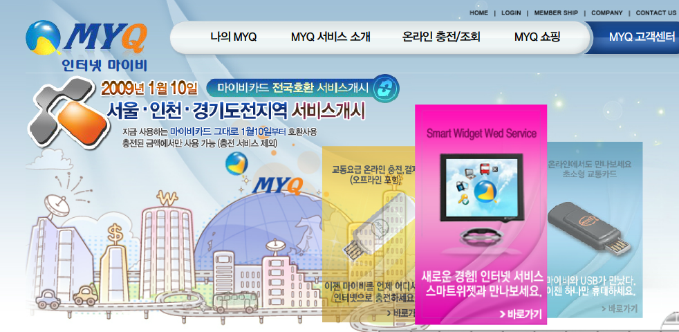
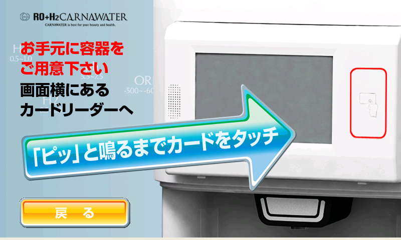
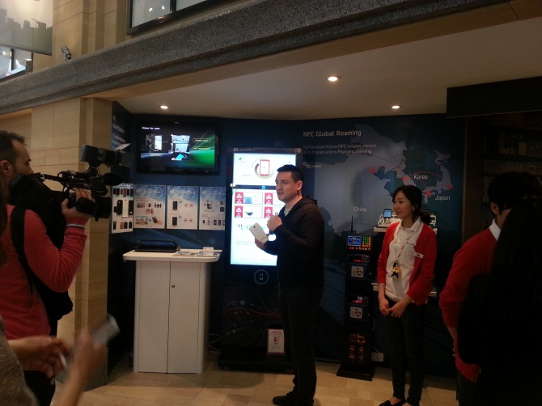
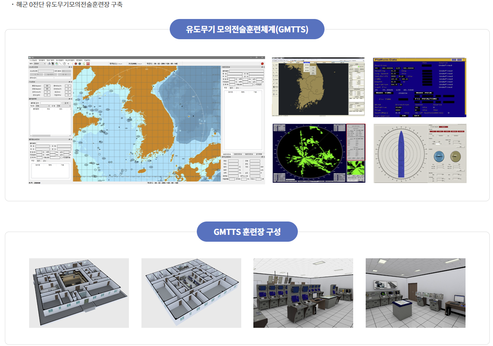
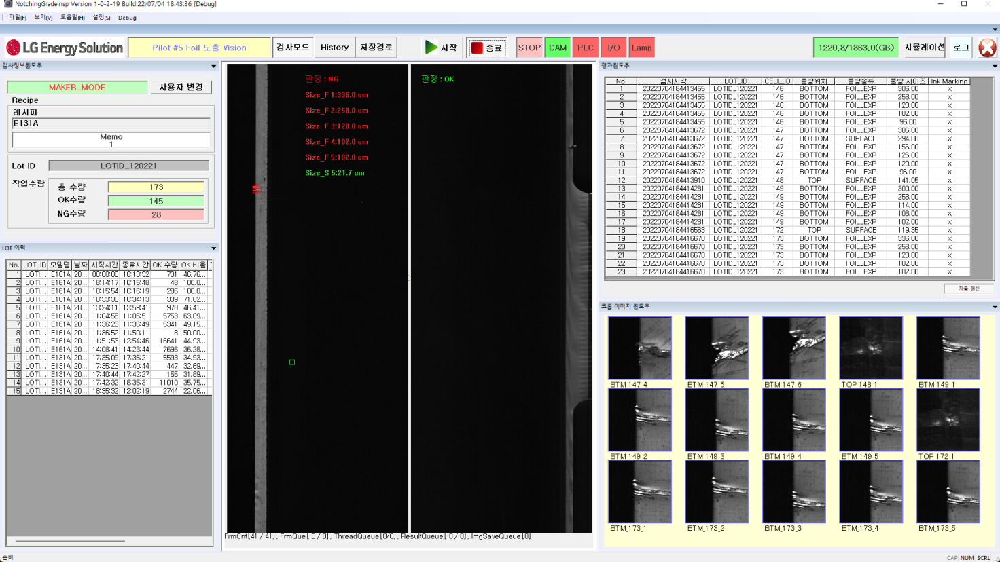

# 이력서

<table>
<tr>
<td width="220" valign="top">

</td>
<td valign="top">

| 항목             | 내용                                                                      |
| ---------------- | ------------------------------------------------------------------------- |
| **성 명**        | 이 현 무                                                                  |
| **성 별**        | 남자                                                                      |
| **주민등록번호** | 700220-1X                                                                 |
| **생년월일**     | 1970년 2월 20일                                                           |
| **주소**         | 경기도 남양주시 진관로22번안길12(다산동)                                  |
| **연락처**       | 전화: 031-556-1458 휴대폰: 010-3888-5763 이메일: vawing21@naver.com |

</td>
</tr>
</table>

---

## 📘 학력

| 기간                      | 학교                             |
| ------------------------- | -------------------------------- |
| 1985년 03월 ~ 1988년 02월 | 동화 고등학교 졸업               |
| 2010년 03월 ~ 2014년 02월 | 한국방송통신대 컴퓨터과학과 졸업 |

---

## 🛠 경력 및 자격

<table border="1" cellspacing="0" cellpadding="6" style="border-collapse:collapse; width:100%; text-align:left;">
  <tr>
    <th style="width:150px;">기간</th>
    <th style="width:180px;">기관</th>
    <th>내용</th>
  </tr>

  <!-- 운전면허 -->
  <tr>
    <td>1988/09</td>
    <td>서울 지방경찰청</td>
    <td>1종 보통, 대형, 렉커, 트레일러</td>
  </tr>

  <!-- 자격증 -->
  <tr>
    <td>2012/08</td>
    <td>한국산업인력관리공단</td>
    <td>정보처리기능사</td>
  </tr>

  <!-- 교육 -->
  <tr>
    <td>2005/01 ~ 2005/08</td>
    <td>KH 정보교육원</td>
    <td>VC 네트워크 프로그래밍 과정</td>
  </tr>

  <!-- 키프 엔터테인먼트 -->
  <tr>
    <td>2006/07 ~ 2007/11</td>
    <td>키프 엔터테인먼트</td>
    <td>3D 온라인 게임 개발</td>
  </tr>

  <!-- AQ㈜(애니쿼터스㈜) -->
  <tr>
    <td rowspan="6">2008/01 ~ 2013/09</td>
    <td rowspan="6">AQ㈜(애니쿼터스㈜)</td>
    <td>Windows용 NFC 솔루션 개발</td>
  </tr>
  <tr><td>온라인 교통카드 충전 어플리케이션 개발</td></tr>
  <tr><td>Android 기반 NFC 솔루션 개발</td></tr>
  <tr><td>WinCE 기반 정수기 물판매/카드결제 시스템 개발(일본)</td></tr>
  <tr><td>다음 광고 · 홍보용 NFC 기반 앱 개발</td></tr>
  <tr><td>KT 버스쉘터 NFC 충전 및 광고 기능 앱 개발</td></tr>

  <!-- 모노시스 -->
  <tr>
    <td rowspan="2">2014/02 ~ 2014/10</td>
    <td rowspan="2">모노시스㈜</td>
    <td>해군 사이버 훈련 시스템 유지보수</td>
  </tr>
  <tr><td>군 LVC(Live, Virtual, Construct) 연동 미들웨어 개발</td></tr>

  <!-- 아레스㈜ -->
  <tr>
    <td rowspan="7">2014/02 ~ 2022/01</td>
    <td rowspan="7">아레스㈜</td>
    <td>해군 작전 분석용 체계 개발</td>
  </tr>
  <tr><td>육군 합동정보모의 모델 체계 개발</td></tr>
  <tr><td>공군 항공무장 효과분석 모델 개발</td></tr>
  <tr><td>육·해·공 통합훈련용 합동분석모델 시험개발</td></tr>
  <tr><td>유도무기 모의 전술훈련장 체계 개발</td></tr>
  <tr><td>군 모의훈련 다수준 해상도 모델 통합 시뮬레이션 시험모델 개발</td></tr>
  <tr><td>공군 패트리어트 미사일 VR 시뮬레이션 훈련체계 개발</td></tr>

  <!-- 유토비즈 -->
  <tr>
    <td rowspan="2">2022/02 ~ 2022/12</td>
    <td rowspan="2">유토비즈㈜</td>
    <td>VR 기반 대함레이더 운용/정비 교육 체계 개발</td>
  </tr>
  <tr><td>VR 기반 헬기 이착함 유도 및 전력공급 모의장비 개발</td></tr>

  <!-- 프로텍코퍼레이션 -->
  <tr>
    <td rowspan="4">2023/03 ~ 2025/05</td>
    <td rowspan="4">프로텍코퍼레이션㈜</td>
    <td>배터리 셀 공정 Notching 검사 비전 프로그램 개발</td>
  </tr>
  <tr><td>TAKANO Film 검사기 업그레이드(SKIE, 효성, KOLON)</td></tr>
  <tr><td>KMI 배터리 충방전 테스트 시스템 애플리케이션 분석</td></tr>
  <tr><td>KOLON Film 검사 DB 업로드 기능 개선 및 데이터 검증</td></tr>

</table>

---

## 📂 프로젝트 경력사항

<table border="1" cellspacing="0" cellpadding="5">
  <thead>
    <tr>
      <th>순서</th>
      <th>프로젝트명</th>
    </tr>
  </thead>
  <tbody>
    <tr>
      <td>1</td>
      <td>스마트카드 Plug&Play 윈도우 위젯 개발</td>
    </tr>
    <tr>
      <td>2</td>
      <td>Windows용 NFC 솔루션 개발</td>
    </tr>
    <tr>
      <td>3</td>
      <td>수소수 정수기 Water 판매 및 결제 시스템 개발</td>
    </tr>
    <tr>
      <td>4</td>
      <td>Windows용 NFC 단말기 HW 인터페이스 모듈 개발</td>
    </tr>
    <tr>
      <td>5</td>
      <td>Daum Digital View·KT Bus Shelter NFC 솔루션 개발</td>
    </tr>
    <tr>
      <td>6</td>
      <td>유도무기 모의 전술훈련장 체계 개발</td>
    </tr>
    <tr>
      <td>7</td>
      <td>패트리어트 미사일 VR 시뮬레이션 훈련체계 개발</td>
    </tr>
    <tr>
      <td>8</td>
      <td>Foil 노출 검사 소프트웨어 개발</td>
    </tr>
  </tbody>
</table>

---

## 🔧 사용 가능 기술

<table border="1" cellspacing="0" cellpadding="5">
  <thead>
    <tr>
      <th>구분</th>
      <th>내용</th>
    </tr>
  </thead>
  <tbody>
    <tr>
      <td><strong>언어</strong></td>
      <td>VisualC++, Delphi7, Java(안드로이드), gcc(리눅스), ATL/COM, WTL, GDB 디버깅, Qt(C++), React, Node.js, Python</td>
    </tr>
    <tr>
      <td><strong>Database</strong></td>
      <td>MSSQL, ORACLE, MySQL, MariaDB, SQLite</td>
    </tr>
    <tr>
      <td><strong>스펙 지식</strong></td>
      <td>NFC 표준, Mifare Card, A-Type Card, Windows PCSC, 군 무기체계, 군 훈련체계, 배터리 셀 검사</td>
    </tr>
    <tr>
      <td><strong>기타</strong></td>
      <td>PLC 연동 시스템 개발, 엔코더 연동 시스템, 기타 HW 연동 시스템 개발</td>
    </tr>
  </tbody>
</table>

---

**위의 내용은 사실과 다름없음을 확인합니다.**  
**작성자 : 이현무 (인)**

## 1. 프로젝트 경력사항

=================================================================

#### 1. 기 관 : 애니쿼터스

<table border="1" cellspacing="0" cellpadding="6" style="border-collapse:collapse; width:100%;">
  <tr>
    <th style="width:180px;">프로젝트명</th>
    <td>스마트카드-플러그 & 윈도우용 위젯 개발</td>
  </tr>

  <tr>
    <th>개발 환경</th>
    <td>Windows XP (데스크탑)</td>
  </tr>

  <tr>
    <th>언어/Tools</th>
    <td>Visual C++ 6.0(MFC), Visual C++ 2003(Win32API, MFC)</td>
  </tr>

  <tr>
    <th>사용 기술</th>
    <td>
      Socket, Image Skin, Window Region, DES(암호화),  
      PCSC(Personal Computer Smart Card) 통신,  
      Windows 드라이버 및 레지스트리 설정
    </td>
  </tr>

  <!-- 프로젝트 내용 - rowspan 적용 -->
  <tr>
    <th rowspan="3">프로젝트 내용</th>
    <td>스마트카드-플러그 & 위젯은 스마트카드 기능을 사용자에게 제공하는 시스템입니다.</td>
  </tr>
  <tr>
    <td>교통카드 조회, 공인인증서 플러그인 연결, 스마트카드 드라이버 설치, PC 보안 기능, 제휴사 사이트 연결 기능 제공</td>
  </tr>
  <tr>
    <td>
      
    </td>
  </tr>

</table>

#### 2. 기 관 : AQ

<table border="1" cellspacing="0" cellpadding="5">
  <tr>
    <th style="width:150px;">프로젝트명</th>
    <td>윈도우용 NFC 솔루션 개발</td>
  </tr>
  <tr>
    <th>개발 환경</th>
    <td>WindowsXP(데스크탑, WinCE단말기)</td>
  </tr>
  <tr>
    <th>언어/Tools</th>
    <td>Visual C++ 2003 (Win32API, WTL)</td>
  </tr>
  <tr>
    <th>사용 기술</th>
    <td>Image Skin, PCSC(Personal Computer Smart Card) 통신</td>
  </tr>
  <tr>
    <th>프로젝트 내용</th>
    <td>
      NFC 솔루션은 Near Field Communication(근거리 무선통신) 비즈니스 모델 구성을 위한 홍보 Application, NFC 표준 스펙 구현 모듈, NFC 칩 통신 방법 등을 구성하기 위한 시스템입니다. 
      초기 NFC 폰(피처폰)의 기능에 대한 비즈니스 모델 설계와 생소한 NFC에 대한 발전, 진화 방향을 위해서 모듈 구성, 해외 NFC 기능 홍보 App 제작. 
      
    </td>
  </tr>
</table>

#### 3. 기 관 : 일본

<table border="1" cellspacing="0" cellpadding="5">
  <tr>
    <th style="width:180px;">프로젝트명</th>
    <td>수소수 정수기 Water 판매 및 결제 시스템 개발</td>
  </tr>
  <tr>
    <th>개발 환경</th>
    <td>WinXP (WinCE 단말기)</td>
  </tr>
  <tr>
    <th>언어/Tools</th>
    <td>Visual C++ 2003 (Win32API, WTL)</td>
  </tr>
  <tr>
    <th>사용 기술</th>
    <td>
      RS-232, PCSC(Personal Computer Smart Card) 통신, Mifare Card 충전 결제(Read, Write), 
      HTTP 프로토콜 통신(업데이트 파일 다운로드 기능), 정수기 작동 PCB 통신(정수기 컨트롤 프로토콜)
    </td>
  </tr>
  <tr>
    <th>프로젝트 내용</th>
    <td>
      수소수 판매 시스템은 정수기 관리, 수소수 판매, 카드 결제, 카드 충전을 통합적으로 할 수 있는 시스템입니다. 
      실행환경은 WinCE입니다. 
      수소수 정수기에서 신용카드 Tag 후 결제하는 네트워크 시스템을 WinCE 환경에서 개발한 시스템입니다. 
      
    </td>
  </tr>
</table>

#### 4. 기 관 : AQ

<table border="1" cellspacing="0" cellpadding="5">
  <tr>
    <th style="width:180px;">프로젝트명</th>
    <td>윈도우용 NFC 단말기용 솔루션 개발(NFC 하드웨어 인터페이스 모듈 개발)</td>
  </tr>
  <tr>
    <th>개발 환경</th>
    <td>WinXP, Win7</td>
  </tr>
  <tr>
    <th>언어/Tools</th>
    <td>Visual C++ 2008(Win32API, WTL)</td>
  </tr>
  <tr>
    <th>사용 기술</th>
    <td>DLL NFC 컴포넌트 제작</td>
  </tr>
  <tr>
    <th>프로젝트 내용</th>
    <td>
      AQ NFC 솔루션은 Windows 기반에서 동작하는 AQ NFC 하드웨어를 사용하기 위한 시스템입니다. 
      NFC 관련 국내 및 MWC 해외전시회에서 시연하는 장면입니다. 
      
    </td>
  </tr>
</table>

#### 5. 기 관 : Daum, KT

<table border="1" cellspacing="0" cellpadding="5">
  <tr>
    <th style="width:180px;">프로젝트명</th>
    <td>Daum Disital View 및 KT Bus Shelter NFC 솔루션 개발</td>
  </tr>
  <tr>
    <th>개발 환경</th>
    <td>Win7</td>
  </tr>
  <tr>
    <th>언어/Tools</th>
    <td>Visual C++ 2008(Win32API, WTL)</td>
  </tr>
  <tr>
    <th>사용 기술</th>
    <td>DLL 컴포넌트 UI 솔루션 제작하여 제공(Window 추상화 : Window 그래픽)</td>
  </tr>
  <tr>
    <th>프로젝트 내용</th>
    <td>
      본 프로젝트는 AQ NFC 솔루션을 실제 적용하기 AQ Component 시스템입니다. 
      KT, Daum에서 NFC에 대한 지식 없이 사용할 수 있는 구조 구현한 AQ Component를 KT, Daum 개발자가 사용하기 위한 작업입니다. 
      
    </td>
  </tr>
</table>

#### 6. 기 관 : 국방부

<table border="1" cellspacing="0" cellpadding="5">
  <tr>
    <th style="width:180px;">프로젝트명</th>
    <td>유도무기 모의 전술훈련장 체계 개발</td>
  </tr>
  <tr>
    <th>개발 환경</th>
    <td>윈도우10</td>
  </tr>
  <tr>
    <th>언어/Tools</th>
    <td>QT(C++)</td>
  </tr>
  <tr>
    <th>사용 기술</th>
    <td>
      함정에서 유도무기를 발사하여 타겟에 도달하기 위한 알고리즘 개발 
      (실제 장비와 같은 기능을 하는 소프트웨어용 UI 포함) 
      네트워크 연동
    </td>
  </tr>
  <tr>
    <th>프로젝트 내용</th>
    <td>
      본 프로젝트는 함정에 배치된 유도무기 발사에 필요한 훈련을 하기 위하여 개발된 소프트웨어용 군 훈련체계입니다. 
      담당업무: SM2, RAM 미사일에 대한 네트워크 연동, 발사 시뮬레이션 데이터 생성 및 발사 알고리즘 개발. 
      
    </td>
  </tr>
</table>

#### 7. 기 관 : 국방부

<table border="1" cellspacing="0" cellpadding="5">
  <tr>
    <th style="width:180px;">프로젝트명</th>
    <td>패트리어트 미사일 시뮬레이션 VR 훈련체계 개발</td>
  </tr>
  <tr>
    <th>개발 환경</th>
    <td>윈도우11</td>
  </tr>
  <tr>
    <th>언어/Tools</th>
    <td>QT(C++)</td>
  </tr>
  <tr>
    <th>사용 기술</th>
    <td>네트워크연동, DB연동, 교육진행 및 평가 시스템</td>
  </tr>
  <tr>
    <th>프로젝트 내용</th>
    <td>
      본 프로젝트는 패트리어트 미사일 발사 훈련을 VR을 이용하여 교육하기 위해서 개발된 프로그램입니다. 
      담당업무: 훈련을 진행하기 위한 엔진 설계 및 훈련 네트워크연결, DB연동하여 훈련평가 등 VR을 제외한 프로그램 개발. 
      
    </td>
  </tr>
</table>

#### 8. 기 관 : LG엔솔

<table border="1" cellspacing="0" cellpadding="5">
  <tr>
    <th style="width:180px;">프로젝트명</th>
    <td>Foil 노출 검사 소프트웨어 개발</td>
  </tr>
  <tr>
    <th>개발 환경</th>
    <td>윈도우11</td>
  </tr>
  <tr>
    <th>언어/Tools</th>
    <td>Visual C++ 2019(MFC)</td>
  </tr>
  <tr>
    <th>사용 기술</th>
    <td>라인카메라를 활용한 비전검사, PLC, 엔코더, 트리거, 네트워크연동</td>
  </tr>
  <tr>
    <th>프로젝트 내용</th>
    <td>
      본 프로젝트는 밧데리 셀 공정에서 전극부분의 절연이 벗겨지는 부분을 검사하는 프로그램입니다. 
      이미지를 취득하여 비전검사를 진행합니다. 
      담당업무는: 비전검사 알고리즘을 제외한 시스템 개발. 
      
    </td>
  </tr>
</table>
